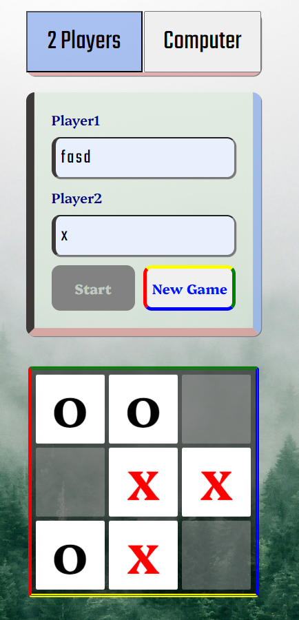

# tic-tac-toe

#### Video Demo : [Demo](https://www.youtube.com/watch?v=dTAWoK4ob7k)

#### Description :

###### BoardManager

This project written purely in javascript with minimal html. The reason why I use pure javascript is to improve my javascript DOM manipulation and to make the app responsive. This project is essentially a basic and simple tic tac toe game with my own implementaion of styles.

At the first line of the script.js, I wrote and IIEF function which is called boardManager. As its name hint, this function is responsible for everything related to the board (Not the UI). I make an empty array called grid to store the board in 2d array version. Inside the function, I wrote a function called createBoard taking no parameters which will create a board for 3\*3 grid. The function returns the board created with by the for loops. The newly created arrays have an object with the property 'value' that stores the value of the cells.

Next, we have isFUll functon inside the boardManager which will check if the provided board is full. What this function does it checks if every row is filled with null which is the default value for empty cell. If there is a cell whose value is not 'null' it will immediately return 'false'.

And we have another function inside the boardManager which takes a parameter as board.
Inside the fn, it will take every value from the the board UI created by the gameManager which is responsible for creating the board in the UI version. Then, it will check against the real board (Not UI) if each button is empty or not. The reason why I loop for each button is because I put value in each button when I create them for easier referencing and interacting with the board UI version.

The next function called 'checkEmpty' take the parameters which are coordinate and the board. The coordinate must be an array and the board must be the board which is created using the 'createBoard' fn. It essentially checks for the cells resulted from the coordinates provided and returns true if the cell is null.

At last, we have 'newBoard' which is the function that deep clone the provided board in the parameter and return back the clone.

###### gameManager

This function is responsible for the game functions.
The first function we see 'checkWinner' checks for winner in the provided board looking for token1,token2. If it find a win position of token1 or token2 it returns the winner value aka token. First, it checks for every row of the board . Then comes column and diagonals. If there is not winning position or layout, it will check the whole board and return false if the board is full.

Then, we have 'createPlayers' which take two parameters (player1, player2). The default value of each are the same as the variable name. First it will declare a players variable which is an object with two properties. It will automatically assign symbol for each players; "X" for player 1 and ditto for player2. Then, we have 'nameToSymbol' and 'symbolToName' which do as its name suggest.

Next we have the implementation of the minMax algorithm which is responsible for calculating the computer's move. To be honest, I don't understand that much of this but I'll try my best. At the first line of the minMax function , we have a constant variable that store the return value of 'checkWinner'. Then, we immediately use this values for the base case of this funcition since this will be a recursive one.
The Base cases checks the depth first and the winner. If the winner is the computer("O") and the active(current turns) is the computer, it will return a score of 100 and vice versa. If the winner variable is "Tie", it returns a score of 0.
Then, I declare two variables 'bestMoveRow' and 'bestMoveCol' to store the best moves result.Then, we have a new board which is a 'shallow clone' of the board provided.

Then, it check for empty cells in the given board and store it in 'emptyCells'. And I declare a variable called 'bestscore' which will be the reference for the bestscore during the recursion.

Next, for every empty cells in the 'emptyCells' it will mark the symbols of the computer and the player's alterenatively. If the score is greater than the bestscore it will update the bestscore and record the row and the col of it too.

Finally it returns the coordinates for the best move.

Next we have 'getTheNextMove' which basically calls the minMax function. What this function provide is that it process the returns value of the minMax function.

In the UI Manager part, I create the UI with DOM manipulation.
The first one we see 'startTheGame' is basically a callback function that starts the game or that append the boardUI to the main body of the document.

Then we have show message which takes two parameters 'message' and 'types'. It checks for the message types and show the message according to it.

Then, we have 'inputUIManger' which is responsible for creating the input fields for names of the players.

The "appendBoardUI" function create a board and append to the main container.

The 'cellsClicked' is the callback function for each cell clicked. It will update the board created by the boardManager according tot the user's move. And checks for winner after every click.

Then, we have 'restartGame' which is responsible for restarting game and is a callback function for the button "restart".
FIrst, it create a new board before deleting the existing board and select the boardUI with its class in the DOM. Then, it remove the old board and start call 'newGameMode()' from the inputUI. It basically, reappend the board created inside the inputUI to replace the old one. Then, reset the variable that records 'turns'.

The 'computerMove' calls the minMax function via 'getTheBestMove' and update the board according to the received coordinate.

The 'click' function update the active turns, the board, and the ui buttons of each cells. It doesn't return anything.

The 'checkWinner' calls the function that checks winner from the 'gameManger' funciton and process the result.

'changeActive' alter or update the variable that record the current player's turn.

"creatBoardUI" creat the board UI and returns the created board element.

'The AddOptions' add a header that add options menu for '2players' and 'computerMode'. It essentially, manage the game mode by referencing the above functions.

**Lastly, we invoke the UI Manger to start the game.**

[Website live Link](https://rex-noir.github.io/tic-tac-toe/)

This game is developed with pure javascript.
